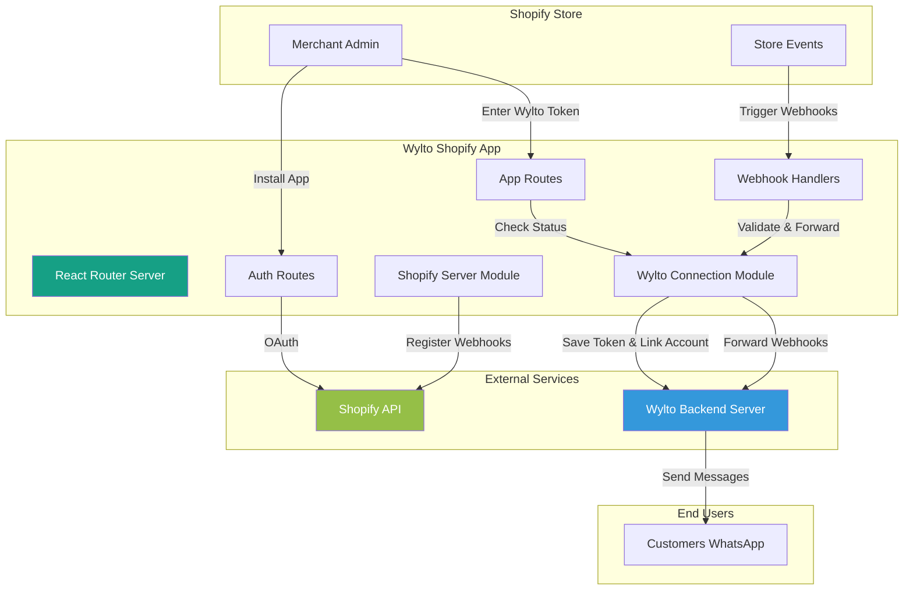
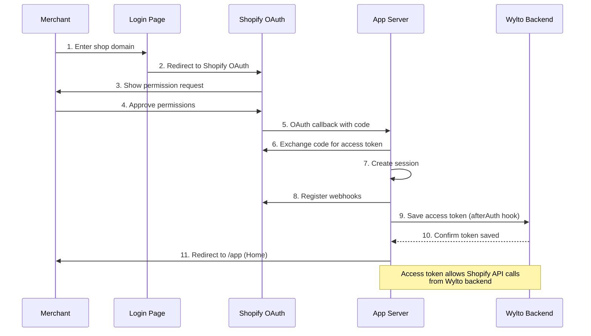
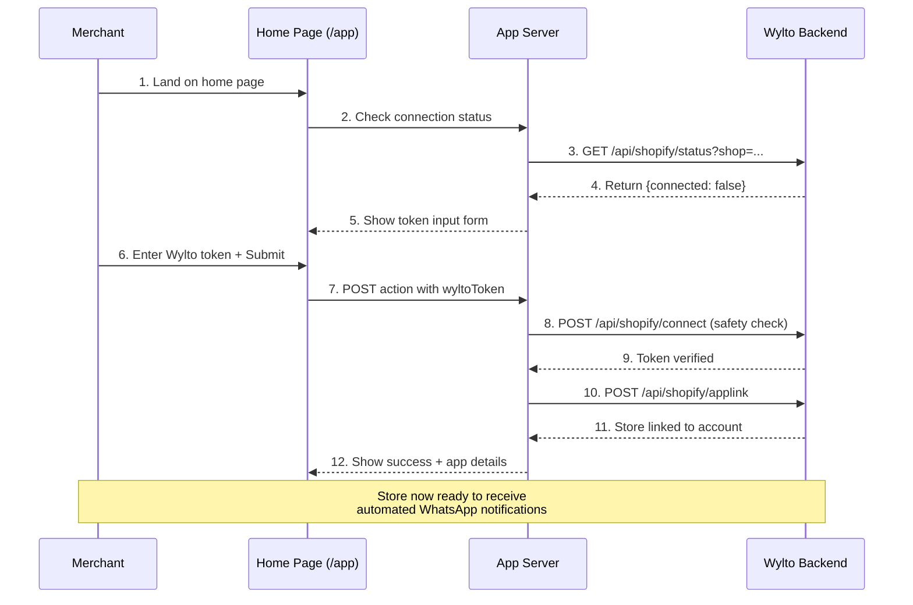
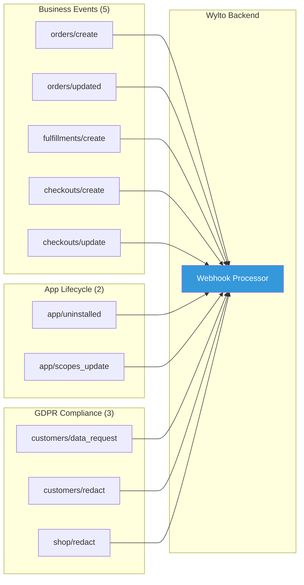
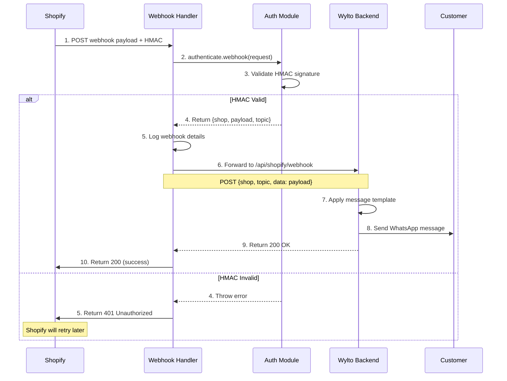
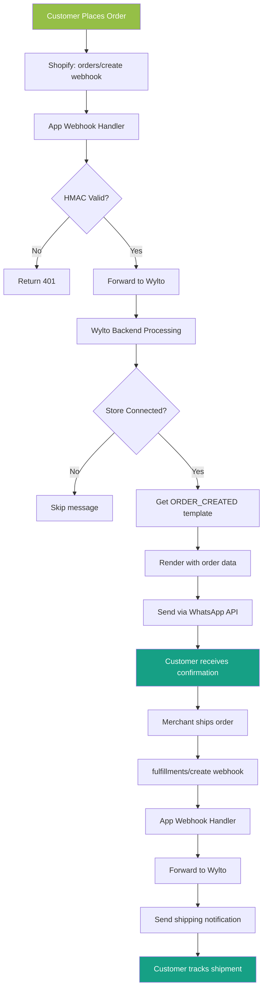
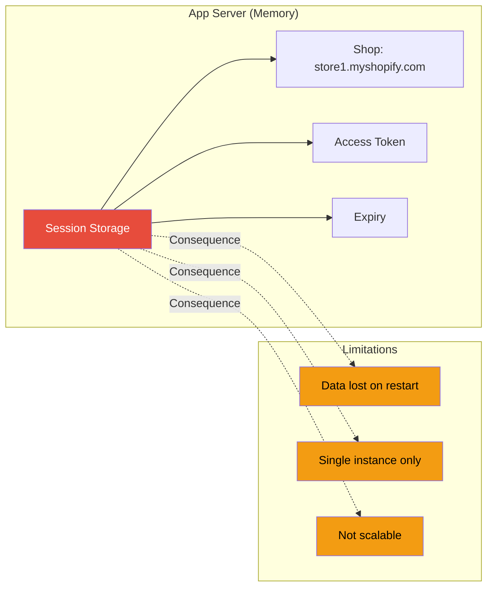
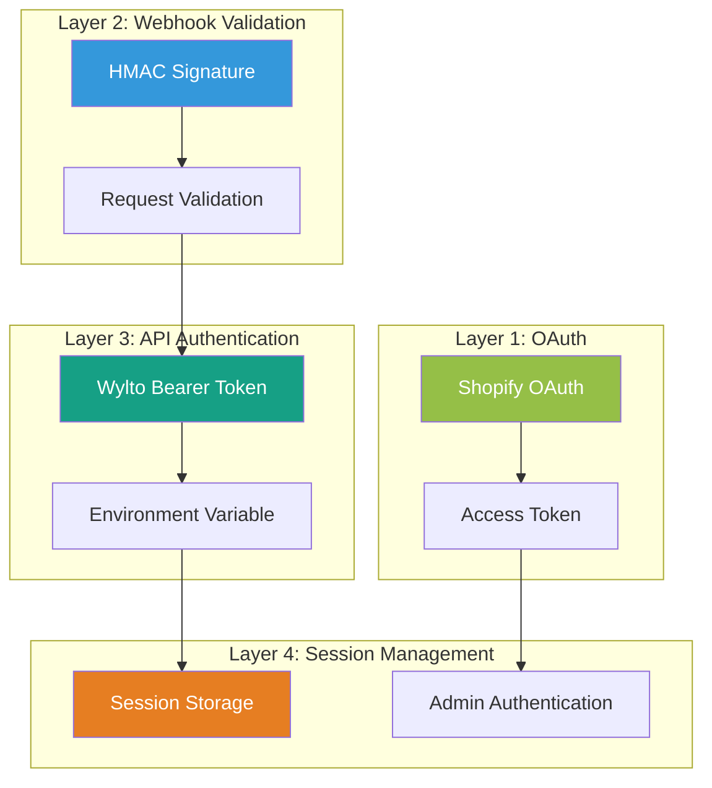
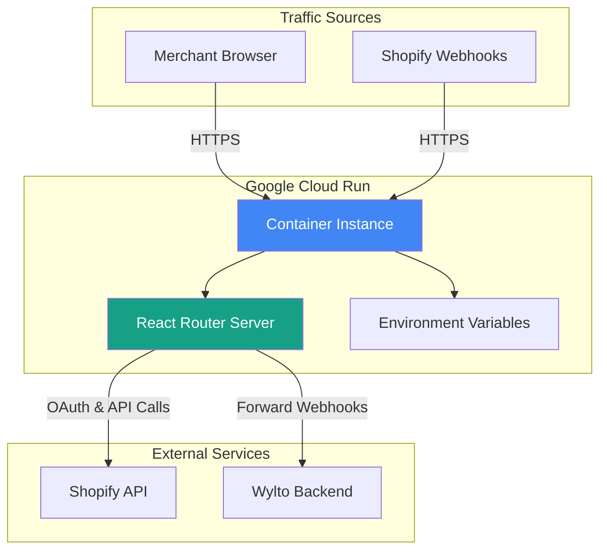

# Wylto-Shopify Integration - Technical Architecture

## Table of Contents
1. [Overview](#overview)
2. [System Architecture](#system-architecture)
3. [Authentication Flow](#authentication-flow)
4. [Installation Flow](#installation-flow)
5. [Webhook Processing](#webhook-processing)
6. [Data Flow Diagrams](#data-flow-diagrams)
7. [Security Model](#security-model)

---

## Overview

The Wylto-Shopify Integration is a public Shopify app that connects Shopify stores with Wylto's WhatsApp messaging platform. It enables automated customer notifications for orders, fulfillments, and abandoned cart recovery through WhatsApp.

**Key Technologies:**
- React Router 7.10.1
- Node.js (>=20.19)
- Shopify App Framework
- Google Cloud Run (Deployment)

**Production URL:** https://wylto-production-pfcaxtk5da-el.a.run.app

---

## System Architecture



### Component Breakdown

| Component | File | Purpose |
|-----------|------|---------|
| **Shopify Server Module** | `/app/shopify.server.js` | Manages Shopify authentication, webhook registration, and session storage |
| **Wylto Connection Module** | `/app/wylto-connection.server.js` | Handles all API communication with Wylto backend |
| **Template Engine** | `/app/wylto.server.js` | WhatsApp message templates for different event types |
| **Auth Routes** | `/app/routes/auth.*` | OAuth login and callback handlers |
| **App Routes** | `/app/routes/app.*` | Protected app pages (home, how-to-use) |
| **Webhook Handlers** | `/app/routes/webhooks.*` | 10 webhook endpoints for Shopify events |

---

## Authentication Flow

### OAuth Installation Flow



### Implementation Details

**File: `/app/routes/auth.login/route.jsx`**
```javascript
// Login form where merchant enters shop domain
export default function AuthLogin() {
  // Validates shop domain format
  // Submits to Shopify OAuth endpoint
}
```

**File: `/app/shopify.server.js`**
```javascript
const shopify = shopifyApp({
  apiKey: process.env.SHOPIFY_API_KEY,
  apiSecret: process.env.SHOPIFY_API_SECRET,
  scopes: ['read_orders', 'read_customers', ...],

  hooks: {
    afterAuth: async ({ session, admin }) => {
      // Step 1: Register webhooks with Shopify
      await registerWebhooks({ session });

      // Step 2: Save access token to Wylto
      await saveAccessToken(
        session.shop,
        session.accessToken
      );
    }
  }
});
```

**Scopes Required:**
- `read_checkouts` - Access checkout data
- `read_customers` - Customer information
- `read_fulfillments` - Shipping data
- `read_orders` - Order details
- `read_products` - Product information

---

## Installation Flow

### Store Connection Process



### API Endpoints Used

| Endpoint | Method | Purpose | Called From |
|----------|--------|---------|-------------|
| `/api/shopify/connect` | POST | Save Shopify access token | `afterAuth` hook |
| `/api/shopify/status` | GET | Check connection status | Home page loader |
| `/api/shopify/applink` | POST | Link store to Wylto account | Home page action |
| `/api/shopify/webhook` | POST | Forward webhook events | Webhook handlers |

**File: `/app/routes/app._index.jsx`**
```javascript
// Home page - Connection interface
export async function loader({ request }) {
  const { admin } = await authenticate.admin(request);
  const shop = admin.rest.session.shop;

  // Check if store is connected to Wylto
  const status = await checkConnectionStatus(shop);

  return { shop, isConnected: status.connected };
}

export async function action({ request }) {
  const formData = await request.formData();
  const actionType = formData.get("action");

  if (actionType === "connect") {
    const wyltoToken = formData.get("wyltoToken");

    // First ensure token is saved (safety)
    await saveAccessToken(shop, accessToken);

    // Link to merchant's Wylto account
    const result = await connectToApp(shop, wyltoToken);

    return json({ success: result.success });
  }
}
```

---

## Webhook Processing

### Registered Webhooks (10 Total)



### Webhook Handler Flow



### Webhook Handler Template

All webhook handlers follow this pattern:

**File: `/app/routes/webhooks.orders.create.jsx`** (Example)
```javascript
export const action = async ({ request }) => {
  try {
    // Step 1: Authenticate webhook (validates HMAC)
    const { shop, payload, topic } = await authenticate.webhook(request);

    // Step 2: Log for debugging
    console.log("Received webhook:", topic, "for shop:", shop);

    // Step 3: Forward to Wylto backend
    const response = await fetch(
      `${WYLTO_API_BASE_URL}/api/shopify/webhook`,
      {
        method: "POST",
        headers: {
          "Content-Type": "application/json",
          Authorization: `Bearer ${WYLTO_API_TOKEN}`,
        },
        body: JSON.stringify({
          shop,
          topic,
          data: payload,
        }),
      }
    );

    // Step 4: Return success
    return new Response(null, { status: 200 });

  } catch (error) {
    console.error("Webhook error:", error);

    // Return 401 for auth failures (Shopify will retry)
    return new Response(null, { status: 401 });
  }
};
```

### Message Templates

**File: `/app/wylto.server.js`**

The app includes 5 predefined WhatsApp message templates:

| Template Key | Trigger | Example Message |
|-------------|---------|-----------------|
| `ORDER_CREATED` | New order placed | "Hi {{customer.first_name}}, your order #{{order.order_number}} has been confirmed!" |
| `ORDER_FULFILLED` | Order shipped | "Your order has been shipped! Track it here: {{tracking_url}}" |
| `ORDER_CANCELLED` | Order cancelled | "Your order #{{order.order_number}} has been cancelled." |
| `ORDER_UPDATED` | Order status changed | "Update on your order #{{order.order_number}}..." |
| `CART_RECOVERY` | Abandoned cart | "You left items in your cart! Complete checkout: {{checkout.url}}" |

**Template Engine Features:**
- Placeholder replacement: `{{field.subfield}}`
- Conditional blocks: `{{#field}}...{{/field}}`
- Fallback values: `{{field || 'default'}}`

---

## Data Flow Diagrams

### Complete Customer Journey



### Session Management



**Note:** For production multi-instance deployments, consider migrating to:
- Redis session storage (`@shopify/shopify-app-session-storage-redis`)
- PostgreSQL session storage (`@shopify/shopify-app-session-storage-postgresql`)

---

## Security Model

### Authentication Layers



### Security Checklist

| Security Measure | Implementation | File |
|-----------------|----------------|------|
| **OAuth 2.0** | Shopify App Framework | `shopify.server.js:19` |
| **HMAC Validation** | All webhook handlers | `webhooks.*.jsx` |
| **Bearer Token Auth** | Wylto API calls | `wylto-connection.server.js:7` |
| **Scope Restrictions** | Read-only permissions | `shopify.app.toml:14` |
| **Session Validation** | Admin route protection | `app._index.jsx:15` |
| **Environment Variables** | Secrets not in code | `.env` (gitignored) |
| **HTTPS Only** | Cloud Run enforced | Deployment config |

### HMAC Validation Process

```javascript
// Shopify sends webhooks with HMAC signature
// Header: X-Shopify-Hmac-SHA256: <signature>

// Our validation (handled by framework):
const { authenticate } = shopify;

try {
  const { shop, payload } = await authenticate.webhook(request);
  // ✓ HMAC valid - process webhook
} catch (error) {
  // ✗ HMAC invalid - reject (401)
  return new Response(null, { status: 401 });
}
```

---

## Environment Configuration

### Required Variables

```bash
# Shopify App Credentials
SHOPIFY_API_KEY=9a34c19041cf5f110b539791f7d8a1ee
SHOPIFY_API_SECRET=<secret>
SHOPIFY_APP_URL=https://wylto-production-pfcaxtk5da-el.a.run.app

# Wylto API Configuration
WYLTO_API_TOKEN=<bearer-token>
WYLTO_API_BASE_URL=https://server.wylto.com  # Optional
WYLTO_API_TIMEOUT=30000  # Optional (ms)

# App Permissions
SCOPES=read_checkouts,read_customers,read_fulfillments,read_orders,read_products

# Development/Testing
WYLTO_TEST_MODE=false  # Set to "true" for mock responses
```

### Development vs Production

| Aspect | Development | Production |
|--------|-------------|------------|
| **URL** | http://localhost:3000 | https://wylto-production-pfcaxtk5da-el.a.run.app |
| **Session Storage** | Memory (OK) | Memory (Single instance only) |
| **Test Mode** | Enabled | Disabled |
| **Logging** | Console | Google Cloud Logging |
| **HTTPS** | Optional | Required |

---

## Deployment Architecture



### Deployment Checklist

1. **Build Application**
   ```bash
   npm run build
   ```

2. **Set Environment Variables** in Cloud Run console

3. **Deploy Container**
   ```bash
   npm run deploy  # Uses Shopify CLI
   ```

4. **Verify Webhooks**
   - Check Shopify Partner Dashboard
   - Confirm all 10 webhooks registered

5. **Test Connection**
   - Install app on test store
   - Enter Wylto token
   - Verify connection status

---

## Performance Considerations

### Optimization Strategies

| Component | Strategy | Benefit |
|-----------|----------|---------|
| **Webhooks** | Async processing | Non-blocking responses |
| **API Calls** | 30s timeout | Prevent hanging requests |
| **Session Storage** | In-memory | Fast access (single instance) |
| **Build** | Vite bundling | Optimized assets |
| **React** | Server-side rendering | Faster initial load |

### Scalability Limitations

Current architecture limitations for multi-instance deployments:

1. **Memory Session Storage** - Not shared across instances
2. **No Database** - No persistent storage
3. **Stateful Sessions** - Requires sticky sessions or migration to Redis

**Recommendation:** For horizontal scaling, migrate session storage to Redis or PostgreSQL.

---

## Monitoring & Debugging

### Log Locations

**Development:**
```bash
# Console output
npm run dev
```

**Production (Cloud Run):**
- Google Cloud Console → Cloud Run → Logs
- Filter by severity, timestamp, request ID

### Key Log Messages

```javascript
// OAuth flow
console.log("Webhook registration successful for shop:", shop);
console.log("Access token saved to Wylto for shop:", shop);

// Webhook processing
console.log("Received webhook:", topic, "for shop:", shop);
console.log("Webhook forwarded successfully");

// Connection status
console.log("Connection status for", shop, ":", status);
console.log("Connected store to Wylto:", result.data);
```

### Common Issues & Solutions

| Issue | Symptom | Solution |
|-------|---------|----------|
| **HMAC Validation Fails** | Webhooks return 401 | Check `SHOPIFY_API_SECRET` matches Partner Dashboard |
| **Connection Fails** | "Store not found" error | Ensure `afterAuth` hook completed successfully |
| **Token Invalid** | 401 from Wylto API | Verify `WYLTO_API_TOKEN` environment variable |
| **Webhooks Not Firing** | No events received | Re-register webhooks via Shopify dashboard |

---

## File Reference Guide

| File Path | Lines | Purpose |
|-----------|-------|---------|
| `/app/shopify.server.js` | 76 | Shopify app configuration, OAuth, webhook registration |
| `/app/wylto-connection.server.js` | 208 | Wylto API client (save token, connect, status) |
| `/app/wylto.server.js` | 340 | Message templates and rendering engine |
| `/app/routes/auth.login/route.jsx` | 87 | Login form for shop domain entry |
| `/app/routes/auth.$.jsx` | 16 | OAuth callback handler |
| `/app/routes/app._index.jsx` | 195 | Home page (connection interface) |
| `/app/routes/app.how-to-use.jsx` | 173 | Usage documentation page |
| `/app/routes/webhooks.*.jsx` | 10 files | Individual webhook handlers |

---

## Next Steps for Developers

1. **Read Developer Guide** - See `DEVELOPER_GUIDE.md` for detailed code walkthroughs
2. **Set Up Local Environment** - Follow installation instructions
3. **Understand Flows** - Review sequence diagrams above
4. **Test Webhooks** - Use Shopify CLI webhook trigger commands
5. **Explore Code** - Start with `shopify.server.js` and `app._index.jsx`

---

**Document Version:** 1.0
**Last Updated:** 2026-01-25
**Maintained By:** Wylto Development Team
